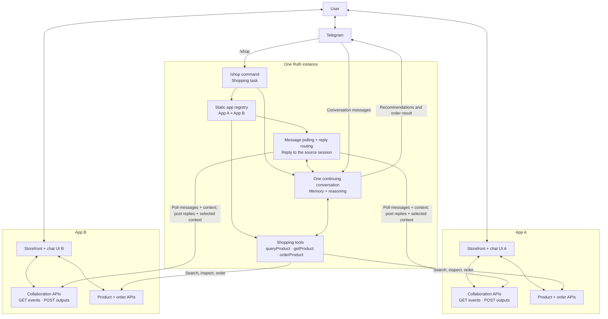

# Ruth shopping demo

Status: proposed demo design; this document does not implement the integration.

The user starts shopping with `/shop` in Telegram. Ruth searches two registered
applications, sends recommendations to Telegram, and continues the same
conversation inside either application. Each reply returns to the application
session that supplied its user message. The demo does not track visits, tab
focus, or a global current application.

## Architecture

Arrows below describe operations and data flow. Ruth initiates all calls to
application APIs; applications do not call a public Ruth endpoint.



## Demo components

| Component | Responsibility |
| --- | --- |
| Telegram `/shop <request>` | Create a shopping task using the request, such as running shoes under $80. An incomplete request can be clarified in the continuing conversation. |
| Static registry | Describe the two supported apps and their configured account connections. No discovery service or central relay is required. |
| Shopping tools | Query candidates, inspect product details, and place a simulated order through the selected app's ordinary APIs. |
| Application message polling | Read both apps' user-message feeds while the shopping task is active. Empty polls do not invoke model reasoning. |
| Shared conversation | Retain preferences, recommendations, comparisons, and source-qualified product references across Telegram and both apps. |
| Reply routing | Post each answer to the original message's app and session. Telegram-originated turns receive Telegram replies. |
| App frontend and backend | Render the app's own chat UI, capture message-time page context, queue messages, and display Ruth's outputs. Each app may retain its own domain logic or AI. |

The implementation can begin with one demo user, one active shopping task, and
two preconnected app accounts. Those account bindings associate each app feed
with the same Ruth conversation; clicking a product link alone does not establish
that identity. Authentication setup is outside the recorded demo.

## Static registry

Keep the registry local to Ruth. Each entry contains:

- `app_id` and display name;
- `base_url` for the app-hosted interfaces;
- a reference to locally stored credentials for the connected app account;
- supported product/order operations, if the two apps need different adapters.

Use the same endpoint schemas in both demo apps. Their catalogs, storefronts,
and chat presentation can differ. A product reference always includes
`app_id` and `product_id`; product IDs alone need not be globally unique.

## Two collaboration endpoints, three shopping operations

Message delivery and context exchange are the paper's two semantic contracts.
For this demo, the contracts share two HTTP operations, following the paper's
compact example. Product and order operations are ordinary app APIs.

| Operation | Proposed route | Demo payload / result |
| --- | --- | --- |
| Receive user messages and app context | `GET /collaboration/events?after={cursor}` | A finite batch of queued user messages, each bound to its session and message-time context; next cursor. |
| Deliver Ruth replies and selected user context | `POST /collaboration/sessions/{id}/outputs` | Reply text, `in_reply_to`, stable output ID, and optional authorized context for the app. |
| `queryProduct` | `GET /products?q=...` | Candidate IDs, names, prices, availability, and canonical product links; optional budget, size, and category filters. |
| `getProduct` | `GET /products/{product_id}` | Details for a candidate or currently selected product, including variants and current price. |
| `orderProduct` | `POST /orders` | Product/variant, quantity, and an idempotency key; returns a simulated order ID and status. |

Example message event:

```json
{
  "event_id": "evt-a-017",
  "session_id": "session-a-01",
  "message": {
    "id": "msg-a-017",
    "text": "How does this compare with the pair from the other store?"
  },
  "context": {
    "revision": "ctx-a-042",
    "page_type": "product",
    "product_id": "shoe-17",
    "selected_variant": "size-9-blue"
  }
}
```

Ruth identifies the app and connected user from the configured, authenticated
feed. The session and product IDs remain app-scoped. App context is evidence
about the page, not permission to access or disclose unrelated private memory.

The context snapshot travels with the message. No continuous page or presence
reporting is needed. In the opposite direction, Ruth can return selected context,
such as the user's shopping budget, for app-owned filtering or presentation.
The complete private conversation is not copied into each application's store.

## End-to-end flow

```mermaid
sequenceDiagram
    actor U as User
    participant T as Telegram
    participant R as Ruth
    participant A as App A
    participant B as App B

    U->>T: /shop running shoes under $80
    T-->>R: User message via Telegram adapter
    Note over R: Start task; load two app connections; start polling
    R->>A: queryProduct / getProduct
    A-->>R: Candidates + links
    R->>B: queryProduct / getProduct
    B-->>R: Candidates + links
    R->>T: Recommendations with links to both apps
    T-->>U: Shoes to consider

    U->>A: Open product; ask "Is this suitable?"
    Note over A: Queue message + current product context
    R->>A: GET events after cursor
    A-->>R: Message + source session + context snapshot
    Note over R: Append turn; reason with continuing conversation
    R->>A: POST outputs to source session
    A-->>U: Show Ruth's answer in chat UI A

    U->>B: Open another product; ask "Better than the first?"
    R->>B: GET events after cursor
    B-->>R: Message + source session + context snapshot
    Note over R: Recall App A comparison in the same conversation
    R->>B: POST outputs to source session
    B-->>U: Show Ruth's comparison in chat UI B

    U->>B: Order this pair in the selected size
    R->>B: GET events after cursor
    B-->>R: Order request + selected product context
    R->>B: getProduct; then authorized orderProduct
    B-->>R: Simulated order result
    R->>B: POST order result to source session
    R->>T: Order notification
    Note over R: Finish task after delivery; stop app polling
```

## Routing and lifecycle rules

1. Start polling both registered app accounts before sending recommendations.
   A one-second interval per app is a proposed demo default, not a measured
   latency guarantee.
2. Polling consumes messages, not presence. An explicit message supplies its
   own reply address: `(app_id, session_id, message_id)`.
3. If the user switches tabs while an answer is pending, that answer still goes
   to its source session. A subsequent message in the other app continues the
   conversation there. No global `current_app` is needed.
4. Serialize reasoning turns for the single demo user. Deduplicate inbound
   event IDs and outbound output IDs, preserving cursors across retries. Order
   calls use an idempotency key to avoid duplicate simulated purchases.
5. Recommendations use products and links returned by app APIs. Resolve an
   order to the requested product and variant; clarify missing details or
   material changes before proceeding. Product APIs remain authoritative for
   price, inventory, and order status.
6. After order completion and final output delivery, or explicit cancellation,
   stop app polling. Telegram remains available. Later app messages wait until
   app polling is resumed, for example by another `/shop` command. The demo ends
   with the order notification.

## What the demo shows

- One Ruth conversation continues through Telegram, App A, and App B.
- Current product context grounds phrases such as "this pair"; retained
  conversation context grounds "the first pair" across apps.
- Different app and chat UIs use the same collaboration contracts.
- Ruth obtains product facts and performs a requested simulated purchase using
  ordinary app APIs, then reports the result on Telegram.

Automatic tracking of app visits, proactive relocation of pending replies,
dynamic app discovery, real payment processing, and concurrent shopping tasks
are outside this initial demo. The broader architecture remains described in
[Application collaboration](app-collaboration.md).
